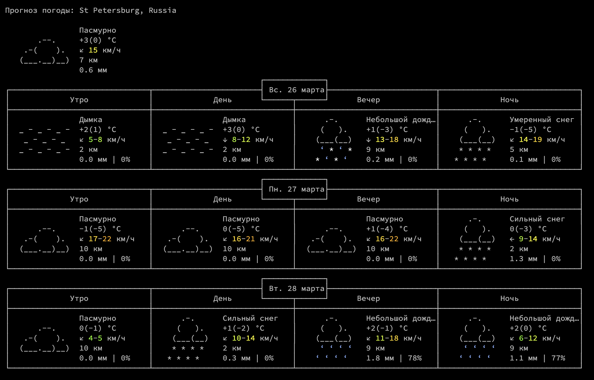

# Прогноз погоды.

Консольное приложение, отображающее прогноз погоды для выбранного списка городов, используя сторонние библиотеки.

## Источники данных

- [Open-Meteo](https://open-meteo.com/en/docs#latitude=59.94&longitude=30.31&hourly=temperature_2m&forecast_days=16) для прогноза
- [Api-Ninjas](https://api-ninjas.com/api/city) для определения координат по названию города

## Функционал

- Отображает прогноз погоды на несколько дней вперед (значение по умолчанию задается конфигом)
- Обновляет с некоторой частотой (задается конфигом)
- Возможность переключаться между городами с помощью клавиш "n", "p"
- Возможность закончить работу программы по Esc
- Возможность увеличивать\уменьшать количество дней прогноза по нажатию клавиш "+", "-"

Список городов, частота обновления, количество дней прогноза определяются в конфиге.

## Отображение

В качестве образца для визуализации был взят следующий интерфейс:

 Скриншот взят с https://wttr.in

Картинки погоды были взяты из следующего [репозитория](https://github.com/schachmat/wego).
